# Building Generative AI application with MongoDB Atlas, Amazon Bedrock, Langchain, and Streamlit

Welcome to our repository, showcasing a reference architecture for building a production-ready Generative AI application. Designed with startups in mind, this architecture leverages:

- **MongoDB Atlas**: A scalable, cloud-based database for efficient storage and retrieval of unstructured data, crucial for training and running AI models.
- **Amazon Bedrock**: A managed service for building, training, and deploying machine learning models at scale, streamlining generative AI workflows.
- **Langchain**: A tool for seamless integration of complex natural language processing pipelines, enhancing the application's ability to understand and generate human-like text.
- **Streamlit**: A framework for rapid development of interactive, real-time data-driven web applications.

## Key Features
- **Production-Ready Chatbots**: Set up sophisticated AI-driven chatbots using customized Docker images.
- **Scalability and Flexibility**: Leverage the cloud for scalable and flexible deployments.
- **Comprehensive Guide**: Step-by-step instructions for developers to build and deploy their AI solutions.

## Prerequisites
* MongoDB Atlas Cluster and Database - [Deploy a free MongoDB Atlas Cluster](https://www.mongodb.com/docs/atlas/getting-started/)
    - Optional: For access to free Atlas credits, apply to the [MongoDB startup program](https://www.mongodb.com/lp/solutions/startups/partners?utm_campaign=startups-partners&utm_source=aws_jlp&utm_medium=community&utm_content=startups#form-container).     
* AWS Account  [AWS Free Tier](https://aws.amazon.com/free/)


## Reference Architecture
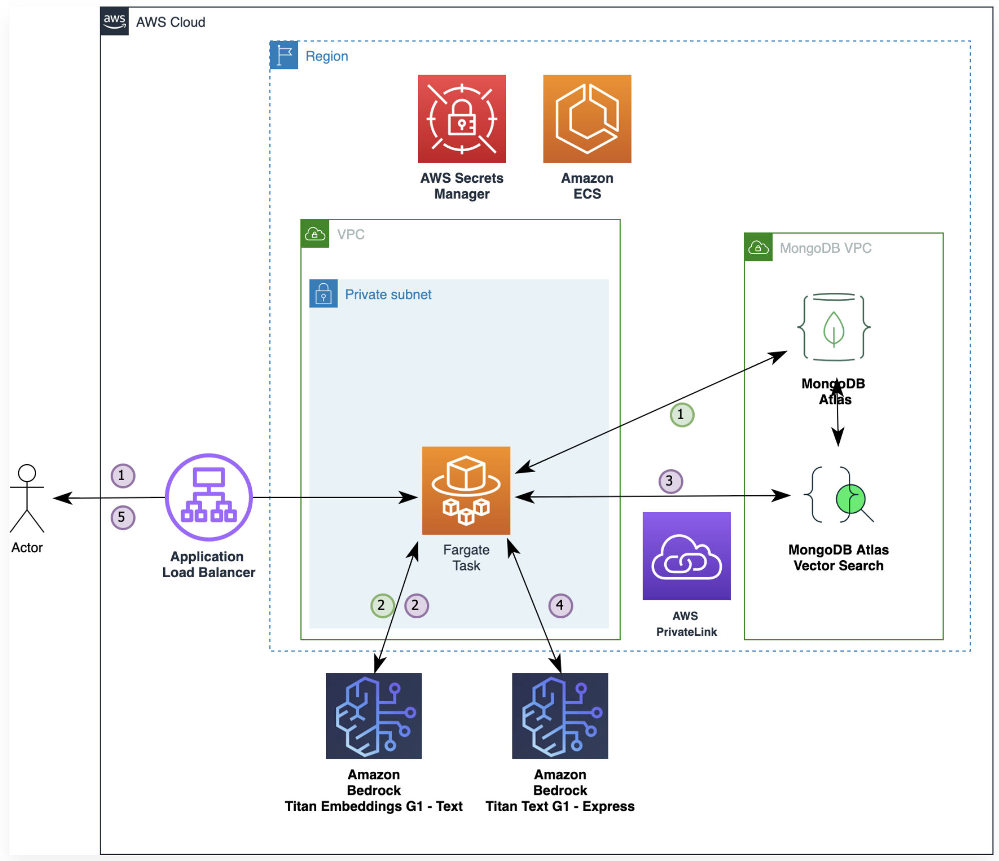

## MongoDB Atlas Setup

### Load MongoDB Atlas Sample Dataset
* In MongoDB Atlas Console, from your Cluster menu select Load Sample Dataset
>

### Vector Search Index Creation
* Navigate to Data Services > Your Cluster > Browse Collections > Atlas Search
> 


* Select `movies` collection from `sample_mflix` database and copy and paste the JSON snippet below.

```
  {
  "fields": [
    {
      "numDimensions": 1536,
      "path": "eg_vector",
      "similarity": "cosine",
      "type": "vector"
    }
  ]
}
```

* Select Next
> 

* Confirm Index Creation by clicking on Create Search Index
> 

* Observe index being created
> 

* Once the index is in status Active, it is ready for use.
> 

## AWS Setup

### Creating a Secret in Secrets Manager
* You can skip this section and create the secret via CLI in the next section
* In AWS Console navigate to Secret Manager and click on Store a New secret
> 

* Choose Other type of secret then Plaintext tab and provide the connection string of the MongoDB Atlas Cluster. We have created the connection string in the previous lab.
> 

* Proceed to the next page where you supply secret name as `workshop/atlas_secret`
>   

* Continue to other pages without any changes to store the secret
> 

* Confirm the secret is created by observing it listed on the page.  Note: you might need hit refresh button to reload the secrets.
> 


### Enable Amazon Bedrock Model Access
* In this step we need to enable access to several models
* In AWS Console, navigate to Amazon Bedrock|Model Access. 
> 
* Click on Manage Model Access and select all models under Amazon. Click on Request model to proceed.
> 
* Observe Access status to be Access Granted
> 

### Setup EC2 Instance
* Start an EC2 Instance

> 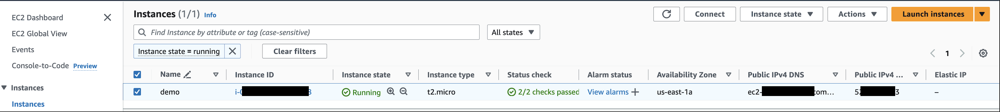

* Connect to the EC2 Instance

> 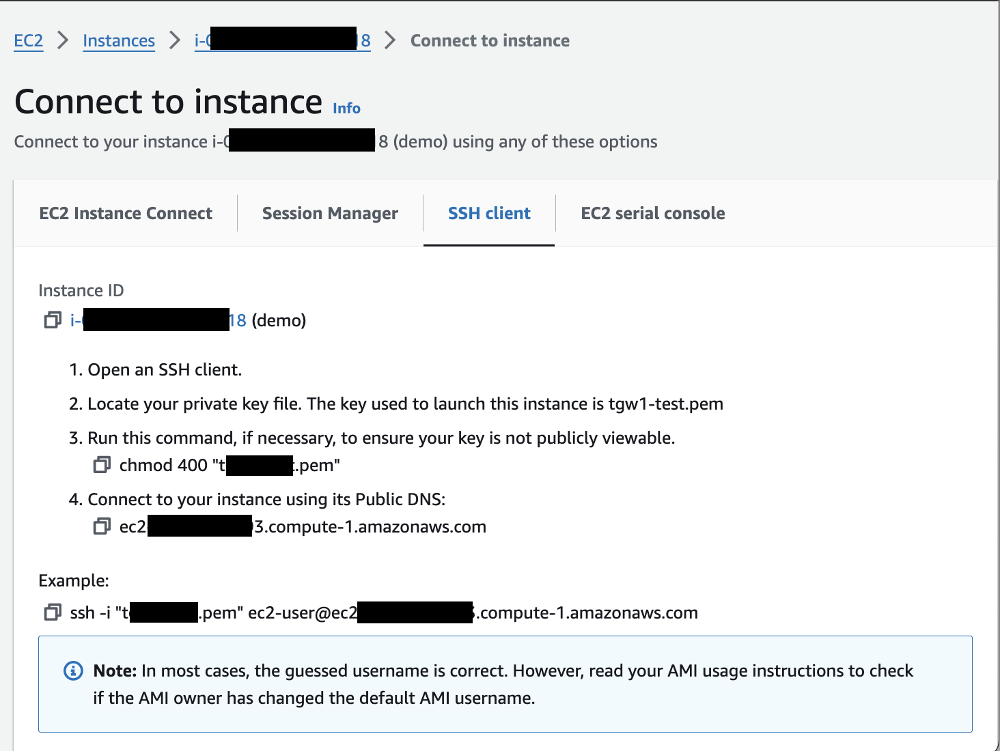

* Install Git and Docker 

```
sudo yum install git
sudo yum install docker
sudo service docker start
sudo usermod -aG docker $USER
```

Relogin once to get the above setting effective.

* Configure AWS CLI
```
aws configure
```


## Generative AI application setup

* Clone the repo
```
git clone https://github.com/mongodb-partners/AWS_MongoDB_Generative_AI.git
cd AWS_MongoDB_Generative_AI/
```


* Install Python Dependencies
```
python3 -m venv .venv
source .venv/bin/activate
pip install -r requirements.txt
```


### Create Embeddings

* Run the following code in terminal and wait for the program to finish:

```
python ./bedrock_atlas_vector_search_streamlit/create_embeddings.py
```


> 

* Now observe the vector containing embeddings created in MongoDB Atlas.  Note: because we are not updating the full dataset you might need to filter the records by supplying this filter expression: `{"eg_vector":{"$exists": true}}`
> 

## Run Search to verify
* In terminal run the following command to perform vector search
```
 python ./bedrock_atlas_vector_search_streamlit/query_atlas.py
```
* Verify that program returns search results:

> 


* Next, we run the program that adds a generative feature.  
```
 python ./bedrock_atlas_vector_search_streamlit/llm_atlas.py
```
* Based on the retrieved description, we are now generating a description for a new movie. 


> 


## Run Streamlit app
* Before we can run the streamlit app, we need install ECS Copilot CLI by running the following commands

```
 sudo curl -Lo /usr/local/bin/copilot https://github.com/aws/copilot-cli/releases/latest/download/copilot-linux    && sudo chmod +x /usr/local/bin/copilot    && copilot --help
```
> 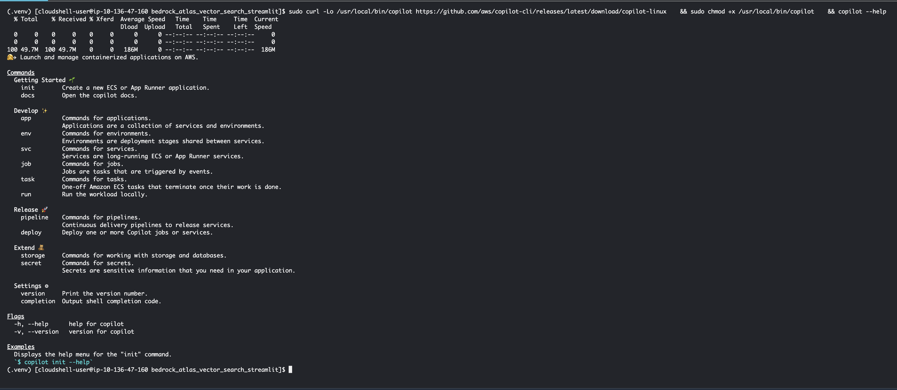

* Install the Application and Environment using ECS copilot

```
copilot init
```

* Select the Application name : ```atlasgenai```

> 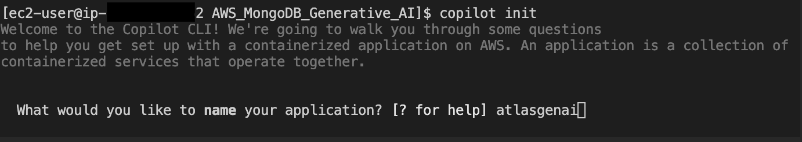


* Select the Load Balanced Web Services 


> 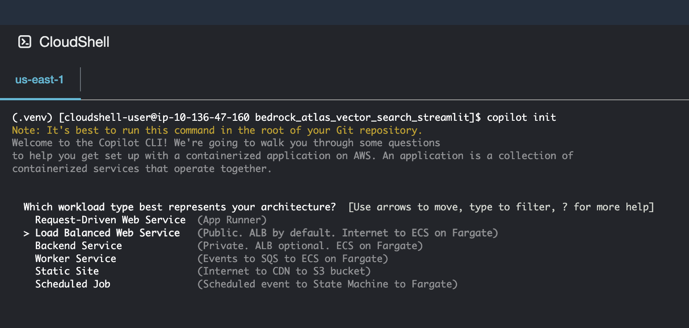


* Name the service  must be ```frontend```as the manifest files is configured for frontend.
> 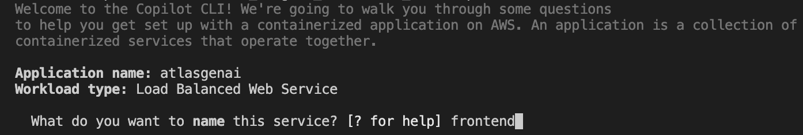


* Enter the custom path for Dockerfile 
> 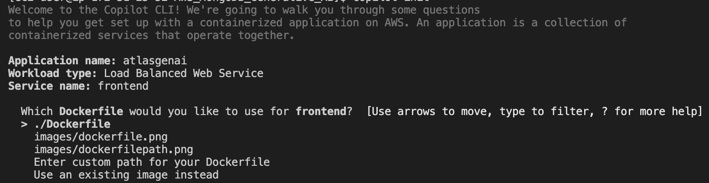


* Give yes to "Would you like to deploy an environment?"
> 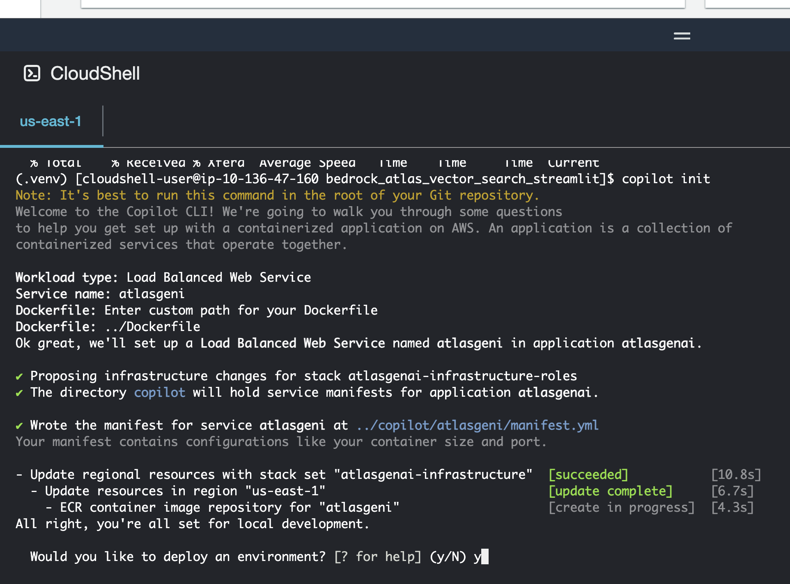

* Name of the environment must be ```dev```, as the manifest files is configured for dev.
> 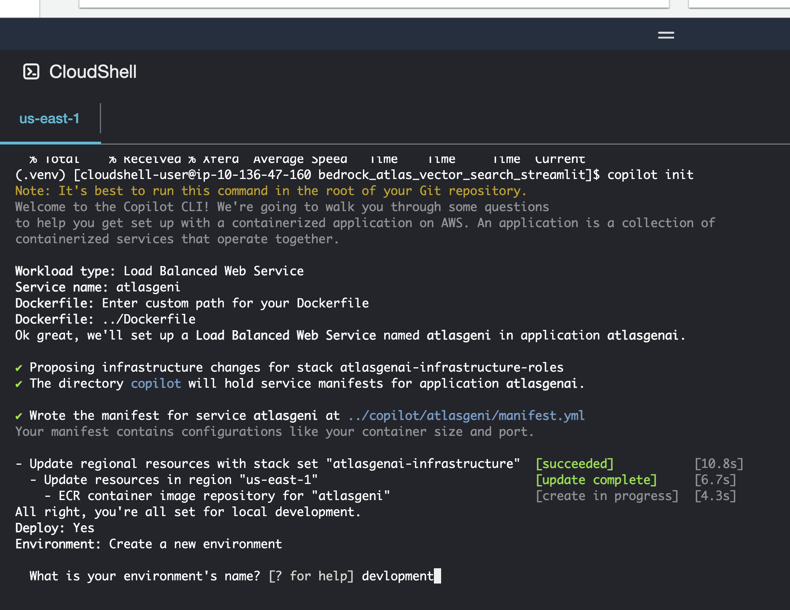


* Ensure the environment is setup successfully

> 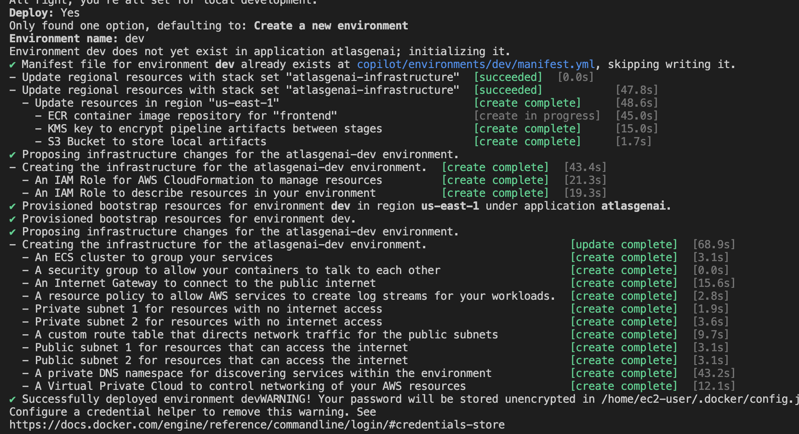

* Then the copilot execute the docker file, pushes the image to the repository and creates the infrastructure. Ensure all the mentioned are created successfully.

> 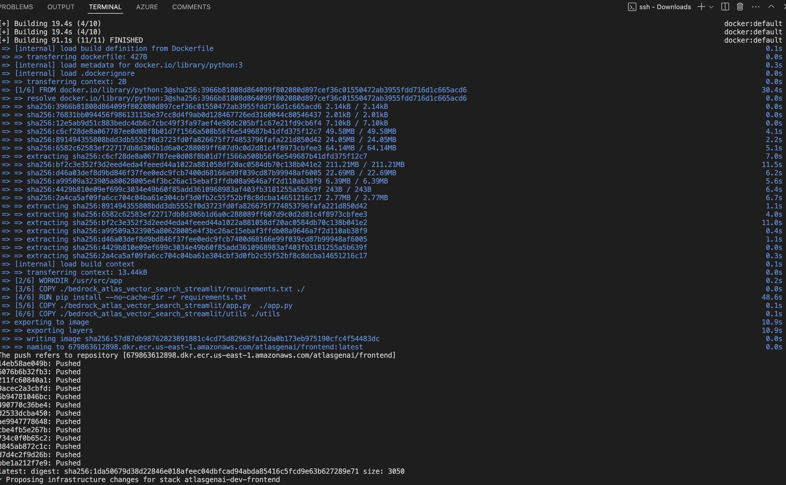

> 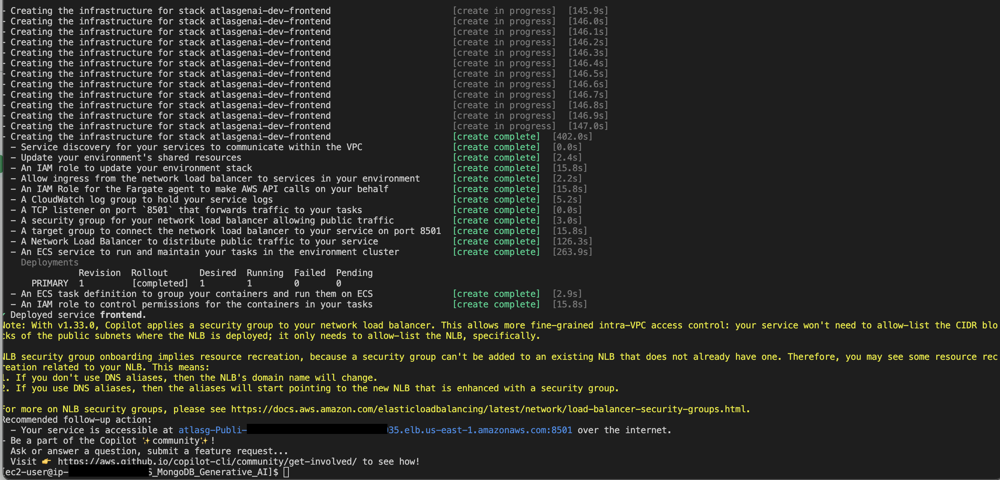


* Update the role name created by the copilot with the pattern "atlasgenai-dev-frontend-TaskRole' set the permission for the role to read security and bedrock

```
aws iam attach-role-policy --role-name atlasgenai-dev-frontend-TaskRole-<XXXXXX> --policy-arn arn:aws:iam::aws:policy/AmazonBedrockFullAccess

aws iam attach-role-policy --role-name atlasgenai-dev-frontend-TaskRole-<XXXXXX> --policy-arn arn:aws:iam::aws:policy/SecretsManagerReadWrite

```

* Open the external URL form the copilot output - refer to the above screenshot for reference - in a separate browser tab. You should see the app loaded


> 

* Type several keywords to generate a new movie description. for example ```romantic comedy sunshine```.  You can add or remove keywords to generate new descriptions.  
> 


# Clean up

```
copilot app delete
```

# Services & Cost Estimations(Approx)

- MongoDB Altas -- Free Cluster
- AWS Account Free tier
- AWS EC2 t2.micro - free 
- AWS S3
- AWS Secret Manager
- AWS ECS
- AWS IAM Role
- Network balancer
- Cloudwatch

# Summary
* Congratulations!  You have deployed an app that performs semantic search in MongoDB Atlas and mashes up several descriptions into one! 
